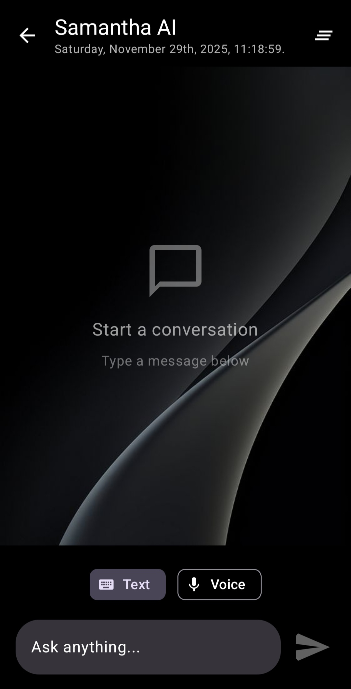

### Samantha EDGE

A permanently offline, LLM-powered virtual assistant, Samantha EDGE provides directions and allows users to ask anything at all at any time. 

Inspired by and based upon the existent [Cactus examples](https://github.com/cactus-compute/cactus-kotlin/tree/main/example).

Title screen:                      | Main screen:
:-----------------------------:|:-----------------------------:
          | 

## 🚀 How to Run

1. **Setup Dependencies**:
   ```bash
   ./gradlew build
   ```

2. **Run the App**:
   ```bash
   # Android
   ./gradlew composeApp:installDebug
   
   # iOS Simulator
   ./gradlew composeApp:iosSimulatorArm64Test
   ```